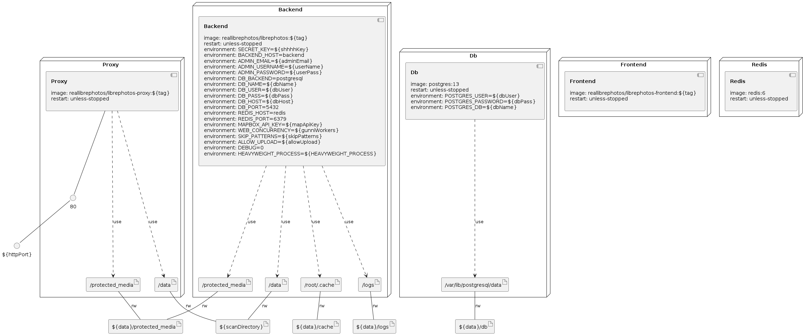

# For common users:
Follow the instructions [here](https://docs.librephotos.com/1/standard_install/)

# For developers:
Follow the instructions [here](https://docs.librephotos.com/1/dev_install/)

# To use your own container names:
Follow the normal instructions as per your chosen build, but after updating the `.env` file to choose your container names, run 
``` sh
make rename
```
Then you can resume following the normal instructions.


### Infrastructure model

